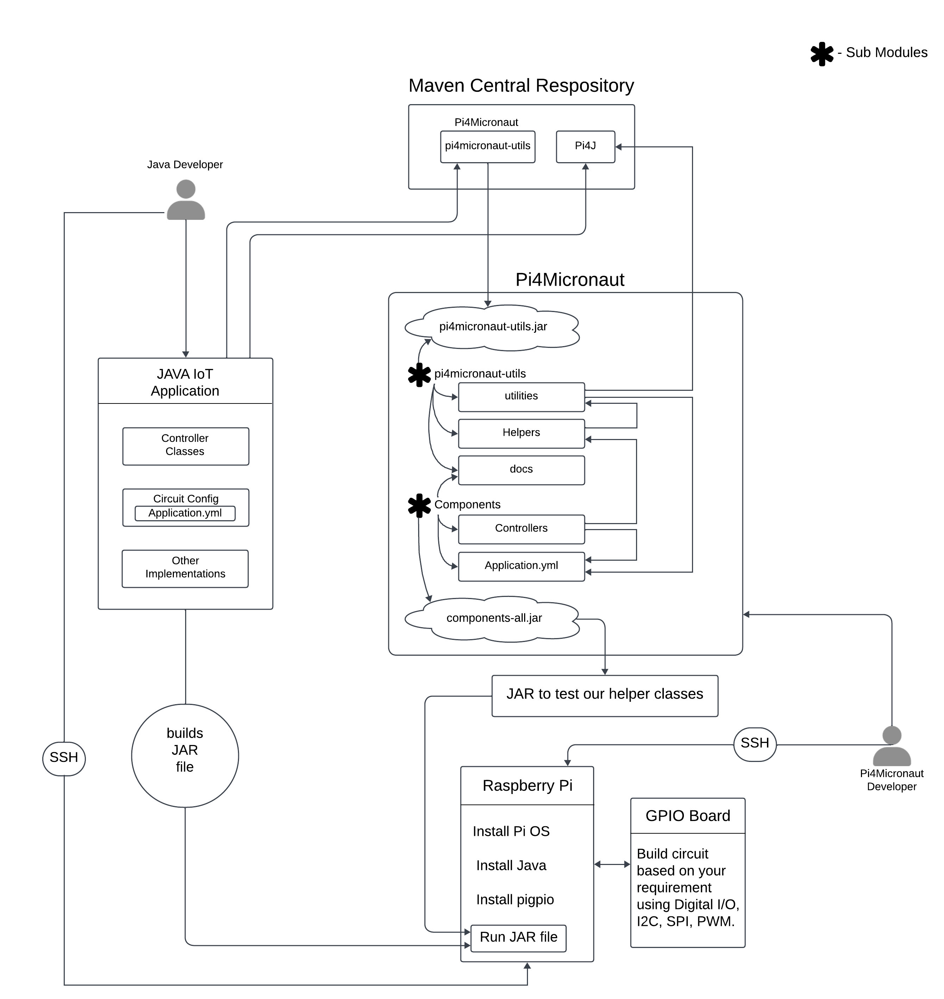

# Contribute to the Pi4Micronaut Library

## General Contribution Guidelines

### Get Familiar with the Library

* Before making contributions, understand the purpose and functionality of the Pi4Micronaut library.

* Review the library documentation, any related articles, or tutorials. 
  * Our documentation can be found online at [oss-slu.github.io/Pi4Micronaut](https://oss-slu.github.io/Pi4Micronaut/). Good information and tutorials on Raspberry Pis and electronic components can be found online from [Sunfounder](https://docs.sunfounder.com/en/latest/), [SparkFun](https://learn.sparkfun.com/), or others. 
  * This file will go over some quick information about our library, but please refer to our documentation webpage for more complete information.

### Set Up Your Development Environment

* Fork the library’s repository from the GitHub.

* Clone your fork locally.

* Follow setup instructions provided in the repository’s README or our online documentation.

### Understand the Contribution Process

* Familiarize yourself with the library’s contribution guidelines.

* Understand the [community guidelines](community-guidelines.md).

### Identify a Way to Contribute

* Bug fixes: Look for open issues tagged as 'bug' or report new ones.

* New features: Discuss new ideas before implementing, to gauge interest and get guidance.

* Documentation: Contribute to the README, ADOC or other documentation.

* Testing: Improve or expand the test suite.

* Refactoring: Optimize existing code or improve its readability.

### Making Changes

* Always create a new branch for your changes.

* Follow the library’s coding style and standards.

* Write clean, well-documented code.

* Add or update tests for your changes, if necessary.

* Commit frequently with meaningful commit messages.

### Test Your Changes

* Ensure that all tests pass.

* Manually test your changes for unforeseen issues.

* Ensure your changes do not introduce regressions.

* Use your own hardware to test the new component integration.

* Note: A test suite will be developed in future to test the components without the use of external hardware

### Signing the Contributor License Agreement

* While creating a pull request, you’ll be prompted to sign a Contributor License Agreement. Please do so by logging in with your GitHub account.

### Submit a Pull Request (PR)

* Push your changes to your forked repository. Create a pull request from your branch to the main library’s main branch.

* In the PR description, explain your changes, motivations, and any decisions made.

* Link to any related issues or discussions.

### Respond to Feedback

* Maintainers or other contributors might provide feedback. Be open to suggestions and make necessary revisions.

* Engage in a constructive dialogue to ensure the quality of the contribution.

### Stay Updated

* Keep your fork synchronized with the main repository to ease future contributions.

* Regularly check for updates or changes in the library’s contribution guidelines.

### Engage with the Community

* Learn more about Open Source with SLU on the [website](https://oss-slu.github.io/), and join the `#project_pi4micronaut` channel in [the OSS Slack community](https://join.slack.com/t/oswslu/shared_invite/zt-24f0qhjbo-NkSfQ4LOg5wXxBdxP4vzfA).

* Help other contributors or users when you can.

* Note: While your contribution is highly valued, there’s no guarantee that all pull requests will be merged. It depends on the library’s direction, quality of the contribution, and decisions of the maintainers.

Thanks for considering a contribution to the Pi4Micronaut library! Your involvement helps make the project better for everyone.

## How to Create a New Component

If it's compatible with a Raspberry Pi, then it should work well with Pi4Micronaut. The following steps should encompass in brief how most components are added to the library; further details can be found on our documentation webpage. Start by creating a new issue to suggest changes.

### Create a Helper

A helper communicates directly with the hardware component. These classes form the core of our library, and they define methods for developers to import into and call in their controllers. For example, to change the color of an RGB LED, the controller will receive the API request to change it. The controller will then call the change color method in the helper. The helper then takes all the actions needed to change the color of the LED.

All helpers should be kept here: `pi4micronaut-utils/src/main/java/com/opensourcewithslu/(inputdevices or outputdevices)`

### Add Component to the Application YAML

Developers using our library will create an `application.yml` file to define necessary configurations for the hardware they are using. To create a controller, the new component will need to be added to the application YAML file found at `components/src/main/resources/application.yml`. More information on the `application.yml` can be found in our online documentation.

For this, you will need to know the communication type for the component. For example, Buzzer works with PWM and LCD1602 works with I2C. Online documentation for your component will be able to tell you what is best. You will also need an understanding of what the circuit will look like; online resources can similarly be useful here.

### Create a Controller

A Controller is a special class type in the Micronaut framework, which developers will build to create APIs using our library. We build controllers in this repository as demonstrations for how to interface with our helper classes. These are kept in a separate top-level folder as the helpers, as the controllers are for demonstration purposes, whereas the helpers are the importable portion of our library.

The controller of a component will have `@Controller("/example")` right above the class declaration that acts as the endpoint for requests to the component. Instead of "example", you should name the endpoint something that is identifiable to the component. Each method of the controller should have `@Get("/exampleEndPoint")` above the method declaration. The endpoint for the method should have the same name as the method and any parameters should be included in the endpoint `/exampleEndPoint/{parameter1},{parameter2}`.

All controllers should be kept here: `components/src/main/java/com/opensourcewithslu/components/controllers`. Consult the [Micronaut documentation](https://docs.micronaut.io/) for more explanation on controllers.

### Thoroughly test

Contributors should thoroughly test their integrations. Software unit tests should be written in `pi4micronaut-utils/src/test/java/com/opensourcewithslu/(inputdevices or outputdevices)`.

Hardware testing should also be done. When submitting a pull request, make sure to include how you tested the component, any circuits that you may have used, and how to run any examples you may have created. Instructions for how to conduct hardware testing, including how to send the files over to the Raspberry Pi device, are on our online documentation.

It is important that reviewers are able to replicate your work in order to properly test the implementation.

### Create documentation for the component

We write documentation files for each component, which are compiled and hosted on our online documentation webpage. Create an .adoc file with the component name as the file name. Make sure to include all the information that the other components include. Simply copy/paste an existing component's documentation and edit as needed. Add the file here: `pi4micronaut-utils/src/docs/asciidoc/components/(inputComponents or outputComponents)`.

Also ensure that the classes you have written have appropriate Javadoc comments.

### Workflow Diagram
