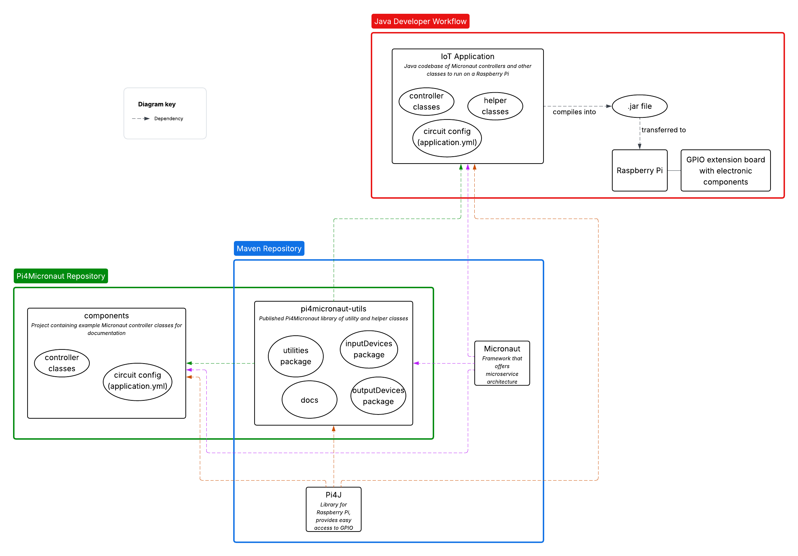

## Overview

Pi4Micronaut is an innovative Java library crafted for developers who aim to build Internet of Things (IoT) applications leveraging the Raspberry Pi platform. This software is designed to run directly on the Raspberry Pi, providing an interface between the high-level Micronaut framework and the low-level hardware control provided by Pi4J. It serves as a vital tool for Java developers who wish to create sophisticated IoT solutions that interact with various sensors and electronic components. By abstracting the complexity of hardware interactions, Pi4Micronaut allows developers to focus on crafting business logic and features, making it easier to bring IoT applications from concept to deployment rapidly.

The existence of Pi4Micronaut is justified by the need for a robust, scalable, and efficient way to bridge the gap between enterprise-grade software and the physical world of hardware. It is particularly valuable for projects that demand both the high-performance, microservices-oriented capabilities of the Micronaut framework and the versatile hardware interaction that the Raspberry Pi offers. Whether it's for home automation, industrial monitoring, or educational purposes, Pi4Micronaut empowers developers to deliver reliable and sophisticated IoT applications that can run headless on a Raspberry Pi or be managed remotely, providing convenience, control, and customization to the end-users.

**Note:** Pi4Micronaut doesn't work with the latest Raspberry Pi 5 because of its whole new architecture. The Pi4J and pigpio libraries doesn't provide support for Pi 5 yet. Look out for the latest version of Pi4J to work with Pi 5 in the future.

### Information

- **Source Code:** <https://github.com/oss-slu/Pi4Micronaut/>
- **Client** Jeff Brown - Unity Foundation
- **Current Tech Lead:** [Leandru Martin](https://github.com/leandrumartin)
- **Developers:**
    - [Joey Heitzler](https://github.com/j-heitz) (capstone)
    - [Thomas Pautler](https://github.com/ThomasPautler952194) (capstone)
    - [Yenkatarajalaxmimanohar Meda](https://github.com/yrlmanoharreddy) (alum, prior tech lead)
    - [Ava Enke](https://github.com/avaenk) (alum)
    - [Seyun Jeong](https://github.com/Ed0827) (alum)
    - [Ralph Tan](https://github.com/RalphTan37) (alum)
    - [Thomas Macas](https://github.com/tmacas) (alum)
    - [Leandru Martin](https://github.com/leandrumartin) (alum)
    - [Ruthvik Mannem](https://github.com/ruthvikm) (alum, prior tech lead)
    - [Adrian Swindle](https://github.com/SwindleA) (alum)
    - [Alex Delgado](https://github.com/adelgadoj3) (alum)
    - [Joe Folen](https://github.com/joefol) (alum)
    - [John Yanev](https://github.com/jyanev) (alum)
    - [Greih Murray](https://github.com/GreihMurray) (alum)
    - [Austin Howard](https://github.com/austinjhoward) (alum)
    - [Traison Diedrich](https://github.com/traison-diedrich) (alum)
    - [Sinuo Liu](https://github.com/liusinuo2000) (alum)

- **Start Date:** August 2022
- **Adoption Date:** August 2022
- **Technologies Used:**
    - Java
    - Micronaut Framework with Gradle
    - Pi4J Library
- **Type:** IoT (Raspberry Pi)
- **License:** [Apache License 2.0](https://opensource.org/license/apache-2-0/)

## Pi4Micronaut
- [Link to Pi4Micronaut Documentation](https://oss-slu.github.io/Pi4Micronaut/)
- [API Reference](https://oss-slu.github.io/Pi4Micronaut/javadoc/index.html)
- [Maven Central Repository](https://central.sonatype.com/artifact/io.github.oss-slu/pi4micronaut-utils)
- [Maven Artifacts](https://repo1.maven.org/maven2/io/github/oss-slu/pi4micronaut-utils/)

### Architecture Diagram

## Example Projects using Pi4Micronaut Library
- [Home Automation](https://github.com/oss-slu/home_automation_rpi)
- [Lab Automation](https://github.com/oss-slu/lab_automation_rpi)
- [OSS SLU Checkin](https://github.com/oss-slu/SLU_OSS_CheckIn)

## Micronaut 4.7.6
- [Micronaut 4.7.6 User Guide](https://micronaut-projects.github.io/micronaut-docs-mn4/4.7.6/guide/)
- [Micronaut Guides](https://docs.micronaut.io/latest/guide/index.html)
- [Micronaut HTTP Client documentation](https://docs.micronaut.io/latest/guide/index.html#httpClient)

## Pi4J 2.4.0
- [Pi4j Documentation](https://pi4j.com/documentation/)

## Shadow Gradle 7.1.2
- [Shadow Gradle Plugin](https://plugins.gradle.org/plugin/com.github.johnrengelman.shadow)

## Pi4Micronaut Contributor License Agreement
- [Link to CLA](CLA.md)
