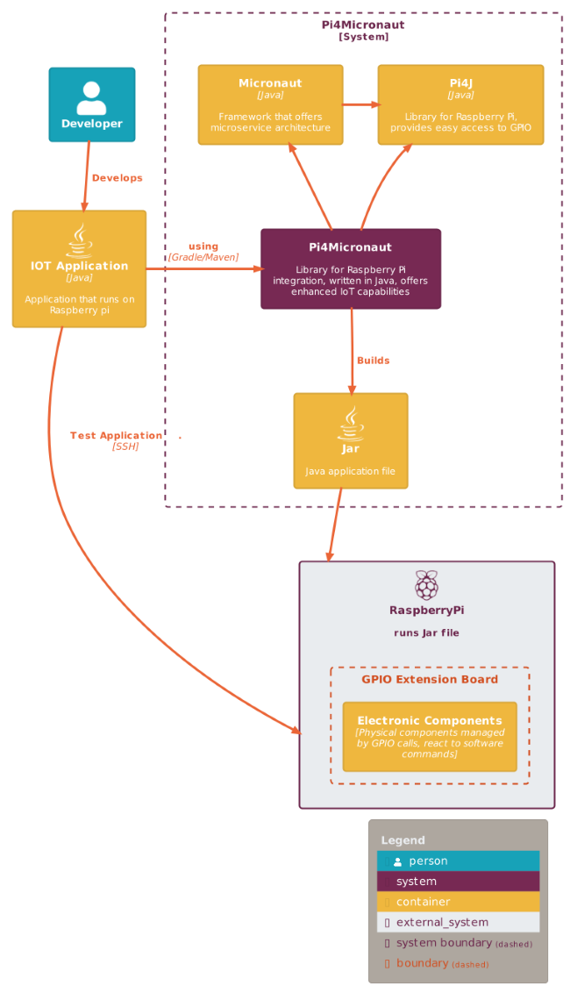

# Summary

Pi4Micronaut is a Java-based library designed and optimized for Internet of Things (IoT) applications on the Raspberry Pi. 
It enables easy integration with various electronic components, including sensors, displays, and actuators, helping researchers 
incorporate these components into their experiments and custom-built instruments. By leveraging the versatility and affordability 
of the Raspberry Pi, Pi4Micronaut allows researchers to develop sophisticated IoT applications that run directly on the Raspberry Pi 
platform without needing a separate computer.

Pi4Micronaut acts as a bridge between the high-level Micronaut framework and the low-level hardware control provided by Pi4J, 
making it easier for researchers to focus on the application logic rather than the complexities of hardware interaction. 
It is ideal for a wide range of fields, including environmental monitoring, behavioral research, and automation of experimental processes, 
providing a flexible, scalable solution for building custom research tools.

# Statement of Need

Scientific research often requires customized data-gathering instruments that can be integrated with a computing platform. 
While some research devices can be connected to a PC, there are situations where more flexible, cost-effective solutions are necessary. 
The Raspberry Pi, due to its affordability, size, and versatility, is a popular choice for such research. Applications for the Raspberry Pi 
include rat licking behavior [@Longley:2017], greenhouse gas effect monitoring system [@Shah:2017],and many other applications [@Jolles:2021]. 
However, interfacing with sensors and other electronic components in Java poses significant challenges. 

Pi4Micronaut addresses this gap by providing a Java-based solution that integrates with Pi4J for GPIO (General Purpose Input/Output) control. 
This allows researchers to use Java, a well-established programming language in scientific computing [@Knoll:2010], to interact with hardware components on the Raspberry Pi, 
enabling the development of custom research instruments at a lower cost. The ability to interface multiple sensors simultaneously also 
promotes collaborative use in shared research environments, reducing the bottleneck often encountered when multiple users need to access sensor data concurrently.

Existing software packages for Raspberry Pi GPIO control include **RPi.GPIO** [@RPi.GPIO], a popular Python library that provides direct, low-level access to GPIO pins and is widely used for simple hardware interfacing and scripting. However, RPi.GPIO is limited to Python and does not offer abstractions for hardware components or support for scalable application architectures. **Diozero** [@Diozero] provides a component-oriented Java API for GPIO, I2C, SPI, and PWM devices, encapsulating devices as high-level classes and supporting multiple board types.

Both Diozero and Pi4Micronaut abstract hardware details, but Pi4Micronaut is mainly focused on Raspberry Pi and is distinguished by its deep integration with the Micronaut framework, enabling advanced features such as dependency injection, modular microservice architectures, and seamless bean management. In Pi4Micronaut, hardware components are managed as Micronaut beans, enabling scalable and maintainable IoT applications for complex research and scientific computing.

Pi4Micronaut simplifies deployment by allowing developers to package the entire application as a single `.jar` file, reducing complexity and improving maintainability. 
Additionally, this deployment model ensures that the entire application, including dependencies, is bundled in one executable file, simplifying installation and reducing the risk of version conflicts.

Researchers can interact with hardware components through intuitive API calls, simplifying the process of developing and extending IoT-based research instruments.
Micronaut’s efficient bean management ensures that beans are instantiated only when needed, reducing memory usage and enhancing performance — a crucial benefit for the limited resources of the Raspberry Pi.
This design choice improves responsiveness and ensures stable performance during real-time data collection, automation, and hardware control.

# Functionality

Pi4Micronaut provides an abstraction layer over Pi4J, making it easier for developers to interact with Raspberry Pi's GPIO pins without dealing with low-level hardware programming.
By combining the Micronaut framework, which is well-suited for building modular microservices, with Pi4J's GPIO control, Pi4Micronaut enables responsive, real-time interaction with 
hardware components through Java.

Key functionalities include:

- Running Micronaut applications directly on Raspberry Pi
- Interacting with GPIO-based sensors and actuators using pre-built interfaces
- Supporting real-time data collection and analysis for research purposes

# Availability

* [Pi4Micronaut library package](https://central.sonatype.com/artifact/io.github.oss-slu/pi4micronaut-utils).
* [Repository](https://github.com/oss-slu/Pi4Micronaut)
* [Documentation](https://oss-slu.github.io/Pi4Micronaut/).

A [check-in system](https://github.com/oss-slu/SLU_OSS_CheckIn) and a simple [security system](https://github.com/oss-slu/Pi4Micronaut/tree/Home_Automation) were created as examples for how to use this library.

# Usage

To start using Pi4Micronaut, follow these steps:

1. Create a [Micronaut Application](https://micronaut.io/launch/).
2. Add the Pi4Micronaut library (`implementation 'io.github.oss-slu:pi4micronaut-utils:v1.1'`) and any required dependencies.
3. Set up the electronic components (e.g., sensors) on a Raspberry Pi GPIO extension board.
4. Configure the components in the `application.yml` file for easy setup and integration.
5. Setup and use the APIs to control and interact with the hardware components from your Micronaut application.
6. Run the Micronaut application on the Raspberry Pi to begin monitoring or controlling the sensors.

# Supported Components

Pi4Micronaut currently supports a wide range of sensors and actuators, including:

- Push Button
- Slide Switch
- Tilt Switch
- Micro Switch
- Rotary Encoder
- RFID Scanner
- LED
- RGB LED
- LCD 1602 Screen
- Photo Resistor Sensor
- Touch Switch Sensor
- Active Buzzer
- Passive Buzzer
- PIR Motion Sensor
- Ultrasonic Sensor
- Servo Motor

More components are planned for future releases.

# Acknowledgments

We would like to express our sincere gratitude to Alex Delgado, Joe Folen, John Yanev, and all other contributors who played an integral role in the development of Pi4Micronaut. 
Their efforts and dedication were essential in shaping the project, leading to the successful releases of versions 1.0 and 1.1. 
We extend special thanks to the early project team, whose groundwork laid the foundation for these milestones. 
Additionally, we are deeply grateful to Jeff Brown from the Unity Foundation for his invaluable guidance and support throughout the project. 
Finally, we offer our appreciation to Dr. Kate Holdener and Daniel Shown from Open Source with SLU for providing both funding and continuous support, making this project possible.

# References
