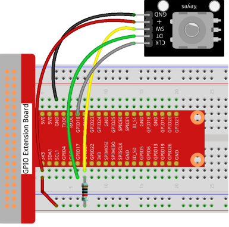

==== Rotary Encoder
[.text-right] 
https://github.com/oss-slu/Pi4Micronaut/edit/develop/micronautpi4j-utils/src/docs/asciidoc/components/inputComponents/rotaryEncoder.adoc[Improve this doc]

===== Overview
This section provides details of the Rotary Encoder circuit,
including its components, assembly instructions, and functionality.

===== Components
. Rotary encoder module
. 1 x 10kΩ resistor
. Breadboard
. Jumper wires
. Power source

===== Circuit Diagram

- Note the resistor location at GPIO 27

===== Functionality
Turning the shaft clockwise will increase the value returned, whereas, turning the
knob counterclockwise will decrease the value returned.

- Incremental Rotary Encoder: The output of an incremental encoder provides information about the motion of the shaft, such as
speed, distance, and position, as it does not return the angular position of the shaft.

- Absolute Rotary Encoder: The output of an absolute encoder is used to measure
angular positions by returning the current position of the shaft.

===== Testing the Circuit
To return the value of the rotary encoder:

[source, bash]
----
$ curl http://localhost:8080/rotaryEncoder/value
----

===== Troubleshooting
- Value not being returned: Make sure all pins on the encoder match up
  to the correct GPIO pins according to the YAML pin order below.
- Make sure that a 10k resistor is being used

===== YAML Pin Order
The order for declaring pins for a Rotary Encoder component in the application.yaml file is as follows

*SW-PIN-INFO, CLK-PIN-INFO, DT-PIN-INFO*

So in the case of

[source, yaml]
----
multi-digital-input:
  rot-encoder:
    addresses: 17, 18, 27
----

the sw pin would be the one connected to GPIO 27, the clk pin would be connected to GPIO 18, and the dt pin would connect to GPIO 17. All lists of values for Rotary Encoder components will follow the same order.

===== Constructors

[source, java]
----
include::../../../../../../micronautpi4j-utils/src/main/java/com/opensourcewithslu/inputDevices/RotaryEncoderHelper.java[tag=const]
----

===== Methods

[source, java]
----
include::../../../../../../micronautpi4j-utils/src/main/java/com/opensourcewithslu/inputDevices/RotaryEncoderHelper.java[tags=method]
----

===== An Example Controller

====== This controller sets up two rotary encoders

[source, java]
----
include::../../../../../../components/src/main/java/com/opensourcewithslu/components/controllers/RotaryEncoderController.java[tag=ex]
----
