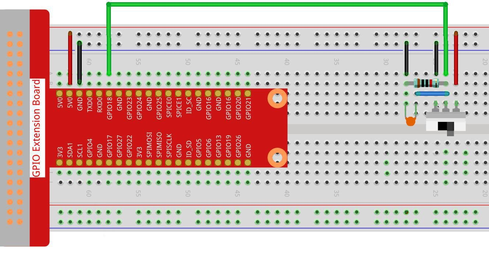

==== Slide Switch

[.text-right]
https://github.com/oss-slu/Pi4Micronaut/edit/develop/micronautpi4j-utils/src/docs/asciidoc/components/inputComponents/slideSwitch.adoc[Improve this doc]

===== Overview
This section provides the details of the Slide Switch circuit, including its components, assembly instructions, and functionality.

===== Components
* Slide Switch
* 1 x 10Ω resistor
* 1 x Capacitor 104
* Breadboard
* 7 x Jumper Wires
* Power source (appropriate voltage, typically 3.3V or 5V)

===== Circuit Diagram
Model:

===== Testing the Circuit:

Use: `curl http://localhost:8080/slideSwitch/switch1` to test the switch. This will either return true,if the switch is on, and false if the switch is off. Flip the switch and run the command again to see the opposite result of the first call.

===== YAML
The slide switch as it appears in the application.yml:

[source, yaml]
----
    slide-switch-input:
      name: Slide Switch Input
      address: 18
      pull: PULL_DOWN
      debounce: 3000
      provider: pigpio-digital-input

    slide-switch-input-2:
      name: Slide Switch Input
      address: 22
      pull: PULL_DOWN
      debounce: 3000
      provider: pigpio-digital-input
----

Note that there are two slide switches, one that uses GPIO 18 and the other uses GPIO 22.

===== Constructors

[source, java]
----
include::../../../../main/java/com/opensourcewithslu/inputDevices/SlideSwitchHelper.java[tag=const]
----

===== Methods

[source, java]
----
include::../../../../main/java/com/opensourcewithslu/inputDevices/SlideSwitchHelper.java[tags=method]
----

===== An Example Controller

====== This controller sets up two slide switches

[source, java]
----
include::../../../../../../components/src/main/java/com/opensourcewithslu/components/controllers/SlideSwitchController.java[tag=ex]
----